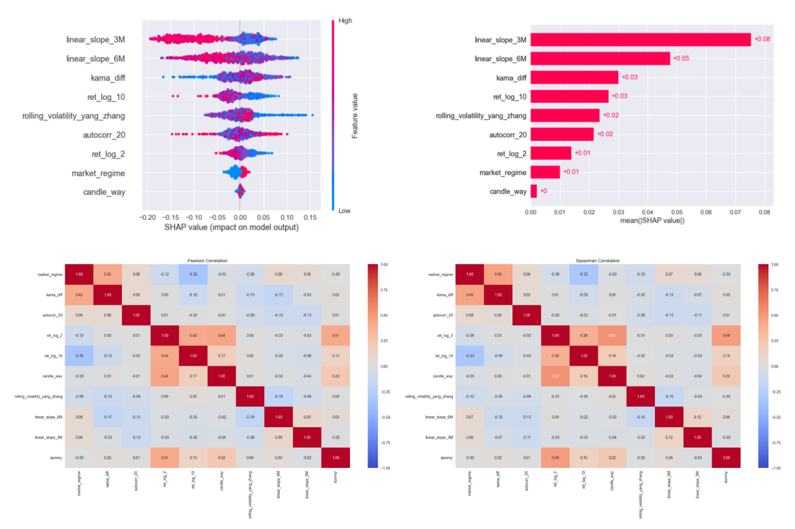

# Machine-Learning-for-Trading-premium-course
This course is designed to take you from understanding the basics of data-driven trading to mastering the tools and techniques needed to build robust trading strategies. Whether you’re a beginner or looking to deepen your expertise, you’ll gain practical knowledge and hands-on experience in creating signals, designing targets, and evaluating models.
By combining theory with practice, this course will equip you with the skills to turn raw data into actionable insights and profitable trading strategies

### What will you be able to do after this course?
After completing this course, you will gain essential skills and knowledge to excel in financial machine learning and trading strategy development. Here’s what you’ll be able to do:
- **Master Features Engineering**: Learn how to transform raw market data into meaningful features that can be used to generate trading insights.
- **Design Target Variables**: Understand how to create target variables tailored to your specific trading goals, ensuring your models have clear and actionable objectives.
- **Understand and Evaluate Models**: Develop the ability to interpret machine learning models, assess their performance, and understand the impact of each variable (creating a true "white box" approach).
- **Compute Trading Signals**: Use features and targets to compute robust trading signals that capture market edges.
- **Build and Test Trading Strategies**: Transform your signals into fully-fledged trading strategies and evaluate their performance in real-world scenarios.
By the end of the course, you’ll not only understand the theory but also have the practical skills to develop, test, and optimize trading strategies.
